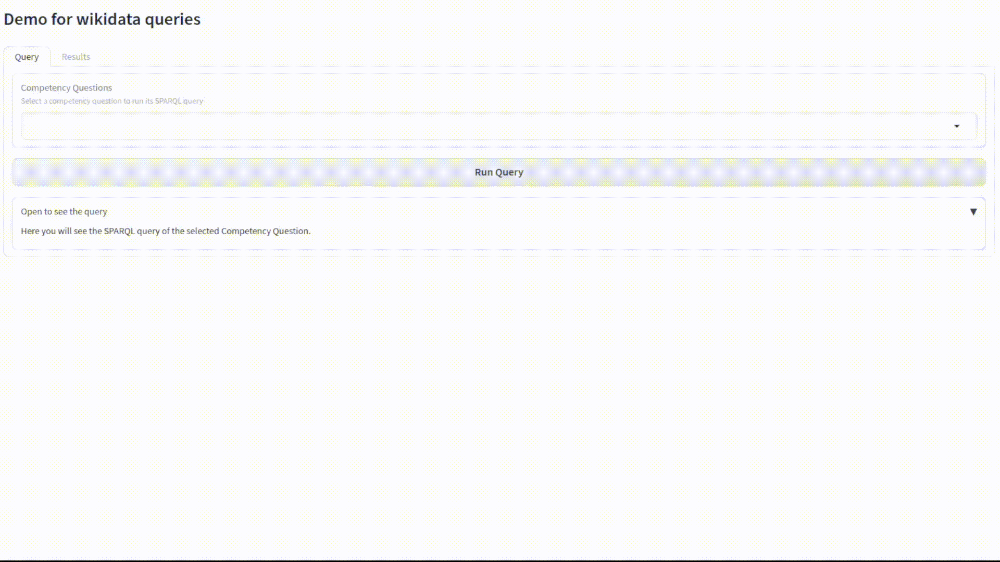

# Sparql Query Demo

## Table Of Contents
- [About](#about)
- [Requirements](#requirements)
- [Before using](#before-using)
- [Usage](#usage)
  * [Python 3.11](#python-311)
  * [Docker](#docker)
  * [Argument list](#argument-list)
    + [General:](#general-)
    + [Queries-related:](#queries-related-)
    + [Requirements-related:](#requirements-related-)
- [License](#license)

## About
Easy deploy a demo capable of executing your sparql queries to the desired target endpoint in a simple way.




## Requirements 
The required python packages are:
```python
gradio==4.16.0
gradio_client==0.8.1
pandas==1.5.3
SPARQLWrapper==2.0.0
```

## Before using
First you need to drag to the ``data`` folder your tabular file (csv, tsv, excel, ...) and to the subfolder ``queries`` the queries. The file structure should look like this:
```
data
├── queries
│   ├── Q1.rq
│   ├── Q2.rq
│   └── Q3.rq
└── requirements.csv
```
It is important that in the requirements file there is a column with the identifier of the competency question/requirement and another column with the text.  **CAUTION:** Query files must have the same name as the requirements file identifier (and end in ``.rq``). In order to read the queries from the ``queries`` folder, the content of the ``requirements.csv`` file should be as follows:
| ID | Question |
| -------- | ------- |
| Q1 | Countries that have a Featured Article on Russian Wikipedia |
| Q2 | List of popes |
| Q3 | US presidents & causes of death |

The column names and separators (```\t``` ```;``` ```,``` ...) can be arbitrary. The application has specific arguments to define them.

*NOTE: The queries used are taken from the examples available on [wikidata](https://www.wikidata.org/wiki/Wikidata:SPARQL_query_service/queries/examples).*

## Usage
**IMPORTANT:** [The above requirements must be met](#before-using)

### Python 3.11
To run directly from python you need version 3.11 and install the requirements:
- ``` pip install -r requirements.txt ```

After that, you just need to run the application with the parameters you want. In this case, to run the example you can use the following code ([look at argument list for more options](#argument-list)):
-   ``` python
    python sparql-query-demo.py \
        --demo_title="Demo for wikidata queries" \
        --endpoint="https://query.wikidata.org/sparql" \
        --return_format="JSON" \
        --include_example="True" \
        --requirements_file="data/requirements.csv" \
        --requirements_separator="," \
        --identifier_columname="ID" \
        --requirement_columname="Question" \
        --query_path="data/queries"
    ```

### Docker
The official image of this demo is posted on dockerhub [ibaiguillen/sparql-query-demo](https://hub.docker.com/r/ibaiguillen/sparql-query-demo). To run the example with docker you need the ```data``` folder as [explained before](#before-using). Remember that you can include more arguments or change them, see ([argument list for more options](#argument-list)).

You can run the application with the following docker command:
- ``` bash
    docker run \
    --name sparql-query-demo \
    -p 9900:9900 \
    -v $(pwd)/data:/sparql-query-demo/data \
    ibaiguillen/sparql-query-demo:v1.0 \
    --demo_title="Demo for wikidata queries" \
    --endpoint="https://query.wikidata.org/sparql" \
    --return_format=JSON \
    --include_example=True \
    --requirements_file=requirements.csv \
    --requirements_separator=',' \
    --identifier_columname=ID \
    --requirement_columname=Question \
    --query_path=queries
    ```

Or you can run docker compose to deploy it:
- ```docker-compose up``` or ```docker compose up```


### Argument list
The parameters that exist and their purpose are as follows:
#### General:
- ```--demo_title```: Title of the demo website. Not mandatory, '*Title of the demo website.*' by default.
- ```--port```: Port in which the demo will be available. Not mandatory, '*9900*' by default.
- ```--endpoint``` Endpoint to which queries point. **Mandatory**.
- ```--return_format```: Endpoint return format. Two options: *JSON* or *CSV*. Not mandatory, '*JSON*' by default. 
    - *Some endpoints such as wikidata do not accept CSV format, so it is recommended to use JSON in that cases.*
#### Queries-related:
- ```--query_path```: Path to the folder where all queries are located. **Mandatory**
    - *Remember that the queries have to end in ".rd" and have the name of the identifier it corresponds to (e.g. "Q1.rq").*
- ```--include_example```: Whether or not to include a test query. Not mandatory, '*True*' by default.
#### Requirements-related:
- ```--requirements_file```: Name of the tabular file with identifier and requirements columns. **Mandatory**.
- ```--requirements_encoding```: Encoding of the requirements tabular file. Not mandatory, default '*utf-8*'.
- ```--requirements_separator```: Tabular file separator. Not mandatory, by default '```,```' (csv).
- ```--identifier_columname```: Name of the column (header) of identifiers. Not mandatory, default '*ID*'.
- ```--requirement_columname```: Name of the column (header) of requirements. Not mandatory, default '*Question*'.

## License
MIT License

Copyright (c) 2024 Ibai Guillén

Permission is hereby granted, free of charge, to any person obtaining a copy
of this software and associated documentation files (the "Software"), to deal
in the Software without restriction, including without limitation the rights
to use, copy, modify, merge, publish, distribute, sublicense, and/or sell
copies of the Software, and to permit persons to whom the Software is
furnished to do so, subject to the following conditions:

The above copyright notice and this permission notice shall be included in all
copies or substantial portions of the Software.

THE SOFTWARE IS PROVIDED "AS IS", WITHOUT WARRANTY OF ANY KIND, EXPRESS OR
IMPLIED, INCLUDING BUT NOT LIMITED TO THE WARRANTIES OF MERCHANTABILITY,
FITNESS FOR A PARTICULAR PURPOSE AND NONINFRINGEMENT. IN NO EVENT SHALL THE
AUTHORS OR COPYRIGHT HOLDERS BE LIABLE FOR ANY CLAIM, DAMAGES OR OTHER
LIABILITY, WHETHER IN AN ACTION OF CONTRACT, TORT OR OTHERWISE, ARISING FROM,
OUT OF OR IN CONNECTION WITH THE SOFTWARE OR THE USE OR OTHER DEALINGS IN THE
SOFTWARE.
